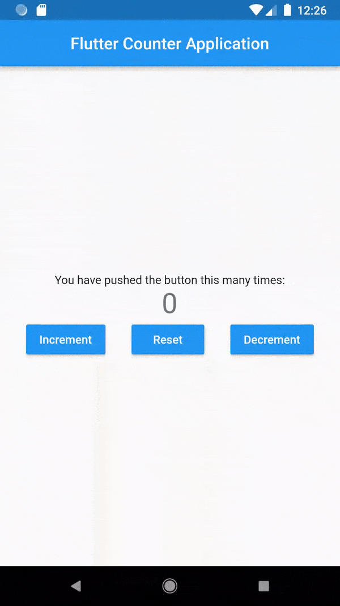

# flutter-Counter-App
 
This is a tweaked version of the counter app which comes as a starter project when we open up flutter on our editor. Feel Free to make or suggest any changed.
 
 
This project has a slightly different layout than the usual starter application.
 
 
It comes with a reset and a decrement button. Furthermore, I have added a snackbar so when a user tries to reset the counter when already at 0, the snackbar pops up with a message. Similar behaviour can be seen when someone tries to decrement it beyond zero(Although the message is slightly different.) You can see the images below for reference. 
 
 
Start Up Screen
 
 
Working Demo: 
 
 

 
 

 
 
Snackbar for reset
 
 

 
 
Snackbar for decrement
 
 
